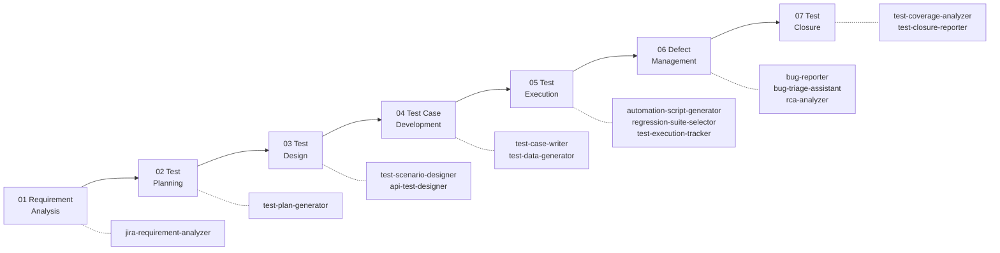
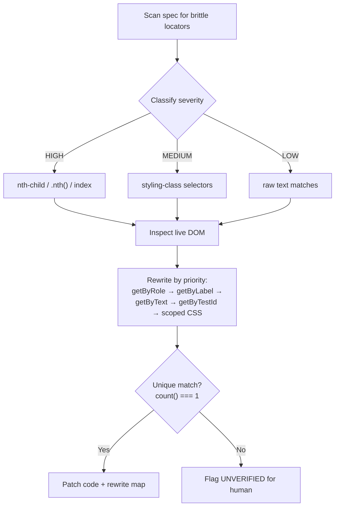

# AgentSkills

AI agent skills and tools for the full software testing lifecycle: requirement analysis, test planning, test design, execution, defect management, closure, and test automation.

This repository contains reusable **agent skills**, self-contained instruction sets that guide AI coding agents (Claude Code, GitHub Copilot, Cline, etc.) to perform specialized QA and testing tasks. What started as a single Test Plan Generator is now a full **STLC skill pack** (14 skills across 7 phases), a **Playwright automation pack**, and a runnable **Playwright demo project**.

---

## 📦 Repository Structure

```
AgentSkills/
├── output/                                    # Generated outputs (test plans, reports)
│   └── test-plan-VWO-49.md                    # Sample: test plan for VWO-49
│
├── stlc_manual_testing/                       # STLC skill pack — 7 phases, 14 skills
│   ├── 01_jira-requirement-analyzer/          # Phase 1 — Requirement Analysis
│   ├── 02_testplan-creater-via-jira_LIVE/     # Phase 2 — Test Planning (flagship)
│   │   ├── SKILL.md
│   │   ├── context/How_to_Create_TestPlan_VWO.md
│   │   ├── copilot/test-plan.prompt.md
│   │   ├── references/requirement-checklist.md
│   │   ├── scripts/fetch_jira.sh
│   │   └── template/test-plan-template.md
│   ├── 03-test-design/
│   │   ├── test-scenario-designer/
│   │   └── api-test-designer/
│   ├── 04-test-case-development/
│   │   ├── test-case-writer/
│   │   └── test-data-generator/
│   ├── 05-test-execution/
│   │   ├── automation-script-generator/
│   │   ├── regression-suite-selector/
│   │   └── test-execution-tracker/
│   ├── 06-defect-management/
│   │   ├── bug-reporter/
│   │   ├── bug-triage-assistant/
│   │   └── rca-analyzer/
│   └── 07-test-closure/
│       ├── test-coverage-analyzer/
│       └── test-closure-reporter/
│
├── test-automation/                           # Automation skill pack
│   └── playwright-pack/
│       └── pw-locator-fixer/                  # Brittle-locator auditor & rewriter
│           └── SKILL.md
│
└── src/                                       # Runnable Playwright demo project
    ├── package.json
    ├── playwright.config.ts
    └── tests/vwo.spec.ts                      # VWO login spec (locator-fixer demo)
```

---

## 🗺️ STLC Roadmap — which skill fires when



---

## 🧰 STLC Manual Testing Pack

**Concept:** One skill per STLC activity. Each skill is a `SKILL.md` with a routing description, a step-by-step workflow, an output contract, and guardrails, so any agent produces the same shape of artifact every time.

**Why:** QA work done ad-hoc by an agent drifts: fabricated acceptance criteria, unprioritized scenarios, bug reports missing repro steps. Encoding each activity as a skill makes the output repeatable and reviewable.

**Q&A — why a skill pack instead of one mega-prompt?**
- **Q: When do I reach for a pack skill?** A: When you hit that STLC phase. "Is this story ready?" fires the requirement analyzer; "file a bug for this" fires the bug reporter. Descriptions route automatically.
- **Q: What does it replace?** A: Copy-pasted prompt templates and tribal "how we write test plans here" knowledge scattered across docs.
- **Q: What's the gotcha?** A: Skills stop at human review gates by design. The agent drafts; a human signs off. No skill in this pack marks anything final on its own.

| Phase | Skill | One-liner |
|-------|-------|-----------|
| 01 Requirement Analysis | `jira-requirement-analyzer` | Scores a ticket against a readiness checklist, surfaces gaps |
| 02 Test Planning | `test-plan-generator` | Jira ticket → review-ready test plan (flagship, see below) |
| 03 Test Design | `test-scenario-designer` | ACs → positive/negative/boundary/cross-role scenarios, risk-tagged |
| 03 Test Design | `api-test-designer` | Endpoint/contract → coverage matrix (happy, schema, auth, negative, boundary) |
| 04 Test Case Development | `test-case-writer` | Approved scenarios → step-by-step executable cases, traceable |
| 04 Test Case Development | `test-data-generator` | Valid / invalid / boundary / synthetic data sets per field |
| 05 Test Execution | `automation-script-generator` | Test case → Playwright/Selenium script skeleton |
| 05 Test Execution | `regression-suite-selector` | Change description → risk-ranked regression subset |
| 05 Test Execution | `test-execution-tracker` | Logs pass/fail/blocked per case, rolls up completion % |
| 06 Defect Management | `bug-reporter` | Failure → structured, reproducible bug report |
| 06 Defect Management | `bug-triage-assistant` | Defect backlog → duplicates grouped, severity proposed, routed |
| 06 Defect Management | `rca-analyzer` | 5-Whys + fishbone root-cause analysis with CAPA |
| 07 Test Closure | `test-coverage-analyzer` | Requirements × tests traceability, surfaces untested areas |
| 07 Test Closure | `test-closure-reporter` | Cycle metrics → closure report with advisory go/no-go |

Every skill follows the same frontmatter contract:

```yaml
---
name: bug-reporter
description: >-
  Turn a failure into a clean, reproducible bug report. Use when a tester
  says "file a bug for this", "write up this defect", or describes
  something broken and wants it documented properly.
license: MIT
metadata:
  author: TheTestingAcademy
  pack: stlc-manual-testing
---
```

---

## 🎯 Playwright Pack — pw-locator-fixer

**Concept:** A skill that scans a Playwright spec or Page Object for brittle locators (XPath, `nth-child`, styling classes, index-based `.nth()`, unanchored text) and rewrites them to resilient, accessibility-first locators, with a before/after rewrite map the engineer verifies.

**Why:** Brittle locators are the #1 cause of flaky UI tests; a DOM reorder or CSS rename silently breaks selectors that "worked yesterday."

**Q&A — why use this?**
- **Q: When do I reach for it?** A: Tests fail intermittently on element lookups, or a spec is full of `//div[...]` and `.btn-primary` selectors. Say "fix these locators."
- **Q: What does it replace?** A: Manual selector archaeology in DevTools, one element at a time.
- **Q: What's the gotcha?** A: It never rewrites blind. It inspects the live DOM first (Playwright MCP or `codegen`) and marks anything it couldn't verify as `UNVERIFIED` for a human check.



Before → after, straight from the demo spec:

```ts
// Before — breaks on any DOM reorder
await page.locator('form div:nth-child(2) input[type="password"]').fill('badpassword123');
await page.locator('.button--primary').click();

// After — anchored to stable ids and accessible roles
await page.locator('#login-password').fill('badpassword123');
await page.locator('#js-login-btn').click();
await expect(page.getByText(/did not match/i)).toBeVisible();
```

---

## 🧪 Playwright Demo Project (`src/`)

**Concept:** A minimal but complete Playwright project (config, spec, npm scripts) targeting the VWO login page, used as the live playground for `pw-locator-fixer`.

**Why:** A skill you can't run against something real is a doc; the demo project turns the locator-fixer into a fail → fix → pass exercise.

**Q&A — why keep a demo project in the repo?**
- **Q: When do I use it?** A: Teaching or demoing the locator-fixer: seed the spec with brittle selectors, run (watch it fail), fix via the skill, re-run (watch it pass).
- **Q: What does it replace?** A: "Trust me, the skill works" — now there's a runnable proof.
- **Q: What's the gotcha?** A: Tests hit the live `app.wingify.com` login page; UI copy changes upstream can affect assertions.

```bash
cd src
npm install
npx playwright install chromium
npm test              # headless run
npm run test:headed   # watch the browser
npm run test:ui       # Playwright UI mode
npm run report        # open HTML report
```

```ts
// tests/vwo.spec.ts
import { test, expect } from '@playwright/test';

test('should show error on invalid credentials', async ({ page }) => {
  await page.goto('https://app.wingify.com/#/login');
  await page.locator('#login-username').fill('wrong@example.com');
  await page.locator('#login-password').fill('badpassword123');
  await page.locator('#js-login-btn').click();
  await expect(page.getByText(/did not match/i)).toBeVisible();
});
```

---

## 🚀 Getting Started (flagship: Test Plan Generator)

### Prerequisites

- **Jira API access** — a Jira account with API token access.
- **`jq`** (recommended) — pretty-printing JSON output from the fetch script.
  ```bash
  brew install jq   # macOS
  ```

### 1. Fetch a Jira Ticket

```bash
cd stlc_manual_testing/02_testplan-creater-via-jira_LIVE

export JIRA_BASE_URL="https://your-domain.atlassian.net"
export JIRA_EMAIL="your-email@example.com"
export JIRA_TOKEN="your-api-token"

./scripts/fetch_jira.sh VWO-49
```

Returns a structured JSON object with key, summary, type, priority, components, labels, description, links, and attachments.

### 2. Generate a Test Plan

#### Option A — Claude Code / Cline (via SKILL.md)

> "Create a test plan for VWO-49 using the test-plan-generator skill"

The agent will:
1. Fetch the ticket via MCP or the `fetch_jira.sh` script
2. Analyze requirements against the gap-analysis checklist
3. Draft the test plan using the template
4. **STOP for human review** — the plan is never marked final without approval

#### Option B — GitHub Copilot (via prompt file)

Place `copilot/test-plan.prompt.md` in your repo at `.github/prompts/test-plan.prompt.md`. Then in VS Code Copilot Chat:

> `/test-plan VWO-49`

---

## 🧪 Test Plan Generator — Workflow

```
┌─────────────────────────────────────────────────────┐
│                                                     │
│  1. FETCH the Jira ticket                            │
│     └─ Via Atlassian MCP / Jira REST API / Paste     │
│                                                     │
│  2. ANALYZE against the requirement checklist        │
│     └─ Flag gaps: missing ACs, ambiguous wording,    │
│        missing test data, env, a11y, security, etc.  │
│                                                     │
│  3. DRAFT the test plan                              │
│     └─ Scope & Objectives                            │
│     └─ Gaps & Questions for the author               │
│     └─ Test Scenarios (P0 / P1 / P2)                 │
│     └─ Test Data & Environment                       │
│     └─ Risks & Assumptions                           │
│     └─ Entry / Exit Criteria                         │
│                                                     │
│  4. STOP FOR HUMAN REVIEW  ←── MANDATORY GATE       │
│     └─ List assumptions made                         │
│     └─ List open questions                           │
│     └─ Ask: "Approve or edit before I continue"      │
│                                                     │
└─────────────────────────────────────────────────────┘
```

### Guardrails

| Rule | Why |
|------|-----|
| Never mark the plan **final** | A human owns sign-off |
| Never fabricate acceptance criteria | A missing AC is a **finding**, not a blank to fill |
| Keep scenarios traceable | Each scenario maps to an AC or a gap |
| Stop for human review | Mandatory before writing test cases or automation |

---

## 📋 Gap-Analysis Checklist

The `references/requirement-checklist.md` covers 5 dimensions:

| Category | Checks |
|----------|--------|
| **Functional** | User story, testable ACs, happy path, negative paths, boundary states, state transitions |
| **Data & environment** | Test data, feature flags, dependencies, preconditions |
| **Non-functional** | Performance, security/roles, accessibility, i18n, audit/logging |
| **Cross-cutting** | Regression surface, backward compatibility, mobile/responsive, rollback |
| **Clarity** | Ambiguous wording, consistent terms, mockups/designs linked |

---

## 📝 Test Plan Template

The `template/test-plan-template.md` produces plans with 6 sections:

1. **Scope & Objectives** — What's in scope, out of scope, and the testing goal
2. **Gaps & Questions for the Author** — Table surfaced from gap analysis (⚠️ / ❌)
3. **Test Scenarios** — Prioritized (P0/P1/P2) with type, scenario, and AC mapping
4. **Test Data & Environment** — Data, flags, roles, permissions
5. **Risks & Assumptions** — What was assumed and what could go wrong
6. **Entry / Exit Criteria** — Gates for starting and completing testing

---

## 📄 Sample Output

See [`output/test-plan-VWO-49.md`](output/test-plan-VWO-49.md) for a real generated test plan covering:

- **Ticket:** VWO-49 — Add Passkey and SSO Login Options
- **14 gap findings** surfaced with questions for the author
- **20 test scenarios** (7 P0, 8 P1, 5 P2)
- Full HUMAN REVIEW GATE with assumptions and open questions

---

## 🔧 fetch_jira.sh — Script Reference

```bash
./scripts/fetch_jira.sh <ISSUE-KEY>
```

**Environment variables:**

| Variable | Description |
|----------|-------------|
| `JIRA_BASE_URL` | Your Jira instance URL (e.g. `https://yourco.atlassian.net`) |
| `JIRA_EMAIL` | Your Jira account email |
| `JIRA_TOKEN` | Your Jira API token |

**Required tools:** `curl`, `jq`

The script fetches the issue and returns a curated JSON object with:
`key`, `summary`, `type`, `priority`, `components`, `labels`, `fixVersions`, `description`, `links`, `attachments`

---

## 🤖 Using as an Agent Skill

### Claude Code

Place any skill folder (e.g. `stlc_manual_testing/06-defect-management/bug-reporter/`) in your project or `~/.claude/skills/`. The `SKILL.md` frontmatter registers it. Then just describe the task:

> "File a bug for this failed login" · "Fix these locators" · "Create a test plan for VWO-49"

### Cline / Roo Code / Other Agent Coders

Point the agent to the `SKILL.md` file or reference it in your CLAUDE.md. The agent reads the workflow, guardrails, and references to execute the task.

### GitHub Copilot

Copy `copilot/test-plan.prompt.md` to `.github/prompts/test-plan.prompt.md` in your repo. Then use:

> `/test-plan VWO-49`

---

## 🛡️ Security

- API tokens are read from environment variables only — never hardcoded
- The `fetch_jira.sh` script never stores or logs credentials
- All plans are **DRAFT** until a human approves — no automated sign-off

---

## 📄 License

MIT — See [SKILL.md](stlc_manual_testing/02_testplan-creater-via-jira_LIVE/SKILL.md) for details.

---

## ✍️ Author

**Pramod Dutta** — [The Testing Academy](https://thetestingacademy.com)
